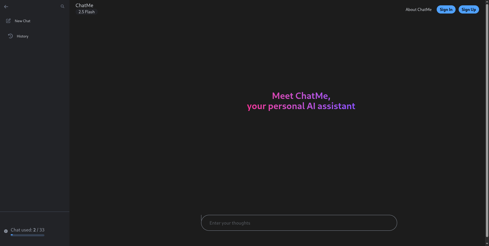
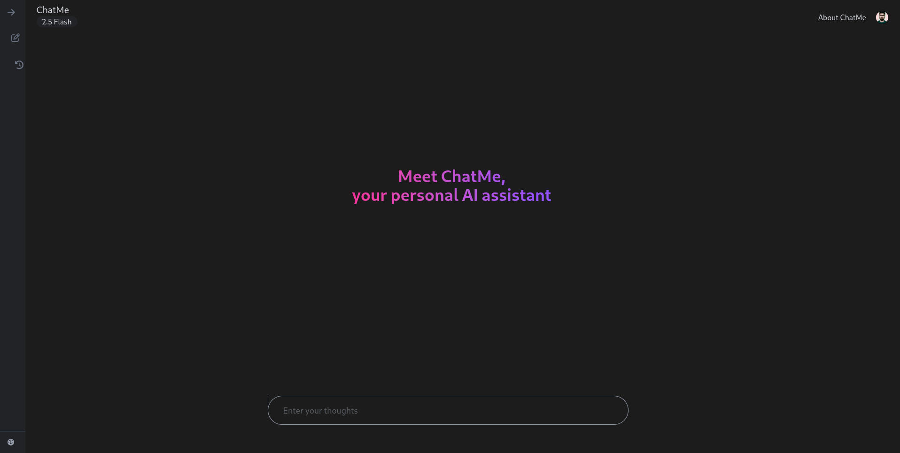

# ChatMe 🤖  
**Gemini-like AI Chatbot built with Next.js, GenAI, Clerk, Zustand, and MongoDB**

ChatMe is an intelligent chatbot app that allows users to authenticate via Clerk, chat with Google Gemini via GenAI, and store their conversation history in MongoDB.

---

## ✨ Features

- 🧠 **Gemini-powered**: Uses Google GenAI (`@google/genai`) to generate smart AI responses.
- 🔐 **Authentication**: Seamless user sign-up and login using Clerk.
- 💬 **Chat Interface**: Smooth React-based chat UI.
- 📦 **State Management**: Global state handled via Zustand.
- 🗃️ **MongoDB Integration**: Saves chat history persistently.
- 🌗 **Dark Mode**: Styled with TailwindCSS 4 and theme support.
- 🔔 **Toast Notifications**: Feedback and errors via `react-toastify`.

---

## 🚀 Tech Stack

| Layer        | Tech                     |
|--------------|--------------------------|
| Frontend     | Next.js 15, React 19     |
| Auth         | Clerk                    |
| AI Backend   | Google GenAI SDK         |
| State Mgmt   | Zustand                  |
| DB           | MongoDB + Mongoose       |
| Styling      | TailwindCSS 4            |
| Notifications| React Toastify           |

---

## 📦 Installation

```bash
git clone https://github.com/your-username/chatme.git
cd chatme
pnpm install
```
## 🔧 Setup Environment
```

# Clerk Auth
CLERK_PUBLISHABLE_KEY=your_clerk_publishable_key
CLERK_SECRET_KEY=your_clerk_secret_key
NEXT_PUBLIC_CLERK_PUBLISHABLE_KEY=your_clerk_publishable_key

# MongoDB
MONGODB_URI=your_mongo_connection_string

# Google GenAI
GOOGLE_API_KEY=your_genai_api_key

```
## 🛠 Available Scripts
```
pnpm dev     # Run in development mode
pnpm build   # Build for production
pnpm start   # Start production server
pnpm lint    # Lint the project

```
## 📁 Project Structure
```
/chatme
  ├── /components       # Reusable React components
  ├── /lib              # Zustand store, utils, etc.
  ├── /pages            # Next.js routing
  ├── /api              # API routes for chat & DB
  ├── /styles           # Tailwind & global CSS
  ├── .env.local        # Environment variables
  └── package.json      # Project config

```
## 📸 Preview
- Home Page 1
 
- Home Page 2
 
